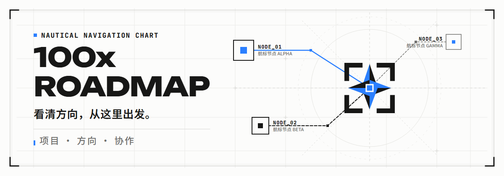
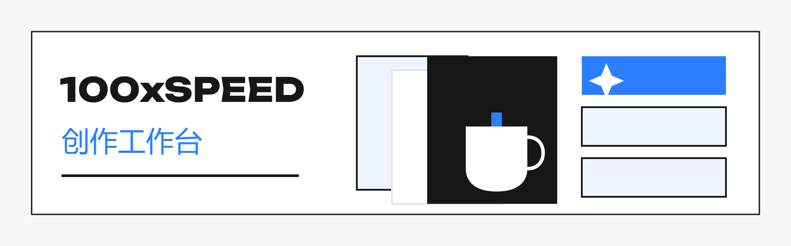
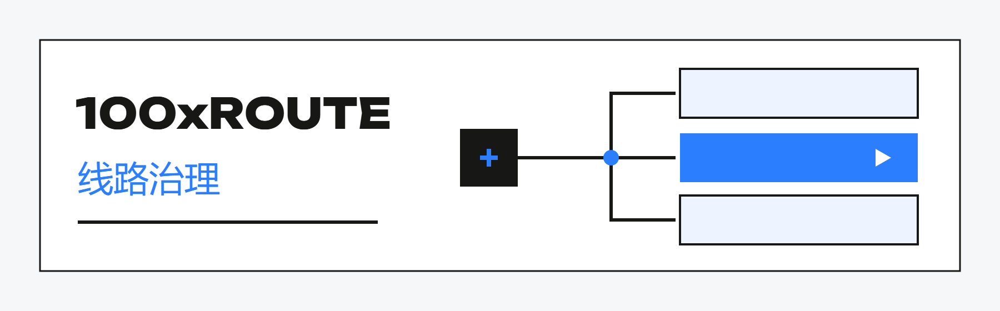
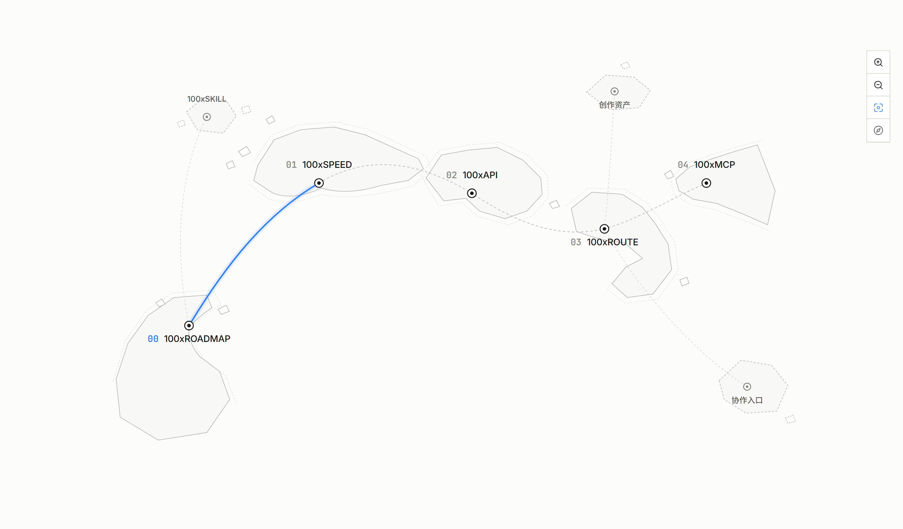

# 100xROADMAP

**从创意到交付，找到你的入口。** 
面向内容创作者、跨境电商团队与开发者。 
看懂产品 · 下载介绍 · 参与建设

**[↗ 生态总览](overview/README.md)**　·　**[↓ 总览 PDF](overview/100x-ecosystem.pdf)**

## ✦ 探索五个产品

每张缩略图都可以点击，打开完整介绍。 
下方插图为产品角色示意；开放与接入状态见各产品说明。

### ✦ 100xSPEED

**把想法整理成任务，把结果留成素材。** 
创意准备 · 批量生成 · 资产管理

[↗ 产品介绍](products/100xspeed/README.md)　·　[↓ PDF](products/100xspeed/100xspeed.pdf)　·　[◇ 完整图解](products/100xspeed/overview.png)

---

### ✦ 100xAPI

**让图片与视频生成，接入你的产品。** 
提交请求 · 跟踪任务 · 取得结果

[↗ 产品介绍](products/100xapi/README.md)　·　[↓ PDF](products/100xapi/100xapi.pdf)　·　[◇ 完整图解](products/100xapi/overview.png)

---

### ✦ 100xROUTE

**看清模型与线路，再做接入选择。** 
能力匹配 · 价格口径 · 运行观察

[↗ 产品介绍](products/100xroute/README.md)　·　[↓ PDF](products/100xroute/100xroute.pdf)　·　[◇ 完整图解](products/100xroute/overview.png)

---

### ✦ 100xMCP

**在 Agent 对话中，完成素材生成。** 
发现能力 · 确认预算 · 生成与下载

[↗ 产品介绍](products/100xmcp/README.md)　·　[↓ PDF](products/100xmcp/100xmcp.pdf)　·　[◇ 完整图解](products/100xmcp/overview.png)

---

### ✦ 100xSKILL

**把内容方法，变成可重复的工作步骤。** 
素材分析 · 表达改编 · 提示词准备

[↗ 产品介绍](products/100xskill/README.md)　·　[↓ PDF](products/100xskill/100xskill.pdf)　·　[◇ 完整图解](products/100xskill/overview.png)

## ✦ 在地图中看位置

复用实际产品地图组件，使用公开系列标签。 
内部项目与优先级已省略；完整地图向受邀成员开放。

[↗ ROADMAP 邀请访问入口](https://roadmap.dkinc.dev/)

## ✦ 从哪里开始

- **想制作素材** → 从 [SPEED](products/100xspeed/README.md) 开始。
- **想在 Agent 中工作** → 看 [MCP](products/100xmcp/README.md) 的工具连接与 [SKILL](products/100xskill/README.md) 的方法。
- **想接入和管理服务** → 看 [API](products/100xapi/README.md) 与 [ROUTE](products/100xroute/README.md)。

## ✦ 一起建设

**选一个方向，带着一个具体任务来。** 
通过现有联系人说明你的经历与想做的事。 
确认范围、交付物与访问权限后开始。

[↗ 公开反馈](https://github.com/kezd088/100x-roadmap-showcase/issues)　·　[↓ 生态介绍 PDF](overview/100x-ecosystem.pdf)

---

**完整产品手册 · 6 份 PDF · 系列图解** 
网站源码、内部资料与部署配置保持私有。 
公开展示不构成网站或品牌素材的开源授权，见 [使用边界](RIGHTS.md)。

资料更新：2026-09-22 · 100xROADMAP
