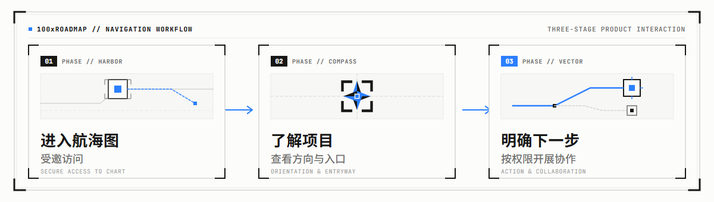

  

# 100xROADMAP

**把项目、方向和协作入口，放进一张航海图。**

100xROADMAP 是 100x 的项目导航与成员入职入口。受邀成员可以通过交互地图了解项目、找到相关入口，并明确下一步如何参与。

[访问 100xROADMAP](https://roadmap.dkinc.dev/) · 网站采用邀请访问

## 从地图开始

- **进入航海图**：通过邀请访问，打开自己的协作入口。
- **了解项目**：查看项目方向、相关入口与协作说明。
- **明确下一步**：根据自己的权限与分工，开展协作。

上图是产品使用示意，不代表具体项目排期或内部技术架构。

## 界面一览

邀请访问入口（2026-09-20 截图）。完整地图与项目资料仅向受邀成员开放。

## 关于本仓库

本仓库用于公开介绍 100xROADMAP，收录产品介绍、品牌插图和精选界面截图。

网站源码、内部路线图、项目资料与部署配置保持私有。本仓库不提供可运行的站点副本；获得网站访问权限也不等于获得其他项目仓库的权限。

如需参与协作，请通过已有联系渠道向邀请人了解访问方式。请勿在公开 Issue 中提交访问码、内部资料或个人信息。

## 使用边界

100x 品牌、原创插图和界面展示保留所有权利；公开展示不构成开源授权。具体说明见 [RIGHTS.md](RIGHTS.md)。
