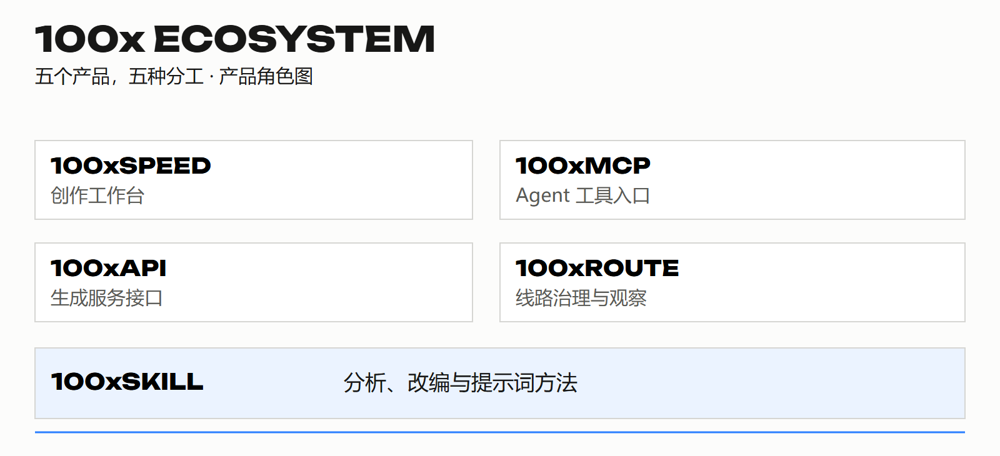

# 100x 生态总览

**把创意变成可以持续交付的工作。**

[← 返回资料库](../README.md) · [下载总览 PDF（4 页）](100x-ecosystem.pdf)

这是一张产品分工图。各产品分别演进，具体接入状态以产品说明为准。

## 五个产品，各自解决什么

### [100xSPEED](../products/100xspeed/README.md)

把提示词、批量生成和资产管理放进同一个创作工作台。

### [100xAPI](../products/100xapi/README.md)

为图片与视频生成提供统一的服务接口。

### [100xROUTE](../products/100xroute/README.md)

看清模型、线路与运行信息，再做接入选择。

### [100xMCP](../products/100xmcp/README.md)

在 Agent 对话中调用 100x 图片与视频生成。

### [100xSKILL](../products/100xskill/README.md)

把内容制作的方法，整理成 Agent 可以重复执行的步骤。

## 用一次素材准备理解分工

为一款保温杯准备短视频素材：先用 SKILL 梳理受众、场景与提示词；在 SPEED 工作台组织多个方向，或在 MCP 对话中提交生成需求。API 关注生成服务，ROUTE 关注线路和运行依据。最后由人检查并保留可用素材。

这个概念案例用于说明产品角色，不表示所有模块已经完成生产联调。

## 选择阅读路径

- 创作者：先看 SPEED。
- Agent 使用者：先看 MCP 与 SKILL。
- 开发与运行团队：先看 API 与 ROUTE。
- 希望参与的人：选择一个具体方向，经现有联系人确认任务、交付和访问权限。

[返回完整目录与参与入口](../README.md) · [使用边界](../RIGHTS.md)
