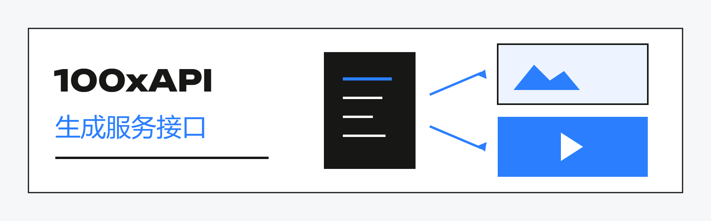
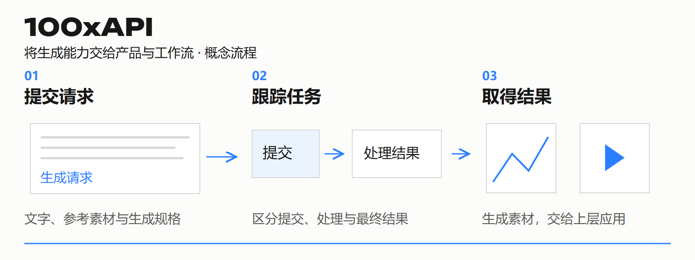

# 100xAPI · 生成服务接口

**把生成能力交给产品，把任务结果交还业务。**

[🔙 返回资料库](../../README.md)　·　[📄 下载完整手册 PDF（6 页）](100xapi.pdf)

## ✦ 阅读导航

[01 定位与价值](#chapter-1)　·　[02 能力与分工](#chapter-2)　·　[03 工作场景](#chapter-3)　·　[04 开始与协作](#chapter-4)　·　[05 参与建设](#chapter-5)　·　[06 问题与入口](#chapter-6)

## ✦ 01 / 生成能力，怎样进入产品

业务需要的往往不只是一个模型回复，还包括可识别的任务、清楚的状态和真正能用的结果。

### 为什么需要它

不同生成服务的输入形式、执行方式和结果结构各异。若每个业务功能都直接处理这些差异，界面与流程容易被某个具体服务牵着走。100xAPI 将图片与视频生成组织为服务接口，让上层应用围绕任务与结果工作。

### 谁会用到

把生成能力接入产品、内部工具或自动化流程的开发者，以及负责生成任务体验与结果可靠性的团队。它不是面向所有访客自由注册的商业 API 门户。

### 当前介绍的范围

已有图片、视频生成及兼容接口实现，支持的输入组合取决于所接模型与服务。服务当前面向内部与受控接入；具体文档、访问方式与权限需经已有联系人确认。

## ✦ 02 / 把调用拆成三个清楚的阶段

请求被接收、任务完成、文件可用，是三件不同的事。理解这些区别，才能做好上层体验。

### 01 / 输入：把生成要求表达清楚

图片与视频任务可能使用文字、参考图片等输入。调用方需要明确任务类型、输入素材和输出规格；模型支持的模式不同，不能假定每个输入组合都能通用。具体字段与兼容范围以获准接入的接口文档为准。

### 02 / 过程：让任务状态可追踪

生成任务可能需要等待处理。上层产品应区分提交、处理中、成功与失败，为用户提供清楚反馈。异常发生时，应依据真实状态和错误信息决定下一步，不把“没有立刻返回成品”简单当成失败。

### 03 / 输出：把结果交给下一步

结果需要能被调用方消费，例如交给创作工作台展示、被 Agent 下载，或进入后续人工检查。真正的交付需要确认文件可获取、类型与规格符合约定，而不只是有一个看似成功的响应。

### 兼容接口的含义

> 工程已有兼容接口实现，便于适配已有调用习惯。兼容性仍需按具体协议、型号与输入方式验证；本介绍不承诺任意客户端、字段或模型行为完全一致。

## ✦ 03 / 案例：把场景图生成加入业务

以下为接入方案示例，不提供生产地址、内部协议细节或可直接运行的调用凭据。

### 业务简报

> 一个商品内容工具希望为保温杯生成场景图。用户提供允许使用的参考素材、场景描述和目标画幅，业务界面需要显示处理过程，并把完成的结果交给用户检查。

### 01 / 接入前明确契约

确认服务允许的模式、输入素材要求和输出形式。将不支持的组合在提交前说明；不要让用户等待到任务结束才知道输入不适用。接入检查应覆盖正常任务与已知失败场景。

### 02 / 给每次工作保留上下文

业务侧记录自己的请求与返回任务之间的对应关系，界面按实际状态更新。记录足够排查的问题线索，同时避免把访问凭据和用户原始素材写入公开反馈。

### 03 / 验证结果，再交付

任务完成后检查结果是否可获取、是否符合预期类型与画幅，再进入素材审核或后续制作。异常时提供具体反馈，不能把占位图、空文件或旧结果当作本次成功。

### 建议验收口径

至少验证：有效输入能获得可追踪任务；错误输入有可理解反馈；等待过程不会误报成功；最终文件能被上层应用使用。这些是接入验收建议，不是已经公布的服务指标。

## ✦ 04 / 服务接口与线路治理，分工不同

API 面向业务调用；线路治理解决的是另一组问题。先区分职责，接入方案才不会失去边界。

### API 对上层应用负责什么

上层产品关心“提交了什么、任务在哪里、结果是什么”。API 说明和接入评估应围绕这些问题展开。SPEED 与 MCP 分别提供面向工作台和 Agent 的使用入口。

### ROUTE 提供什么判断依据

ROUTE 聚焦模型目录、候选线路、配置、价格与运行观察。知道有哪些选择，并不等于任一具体任务已经自动使用某条线路；实际调度范围由部署与接入决定。

### 建议的接入顺序

先说明业务场景与预计输入输出，确认获准使用的服务；再选一个小任务验证完整过程；然后明确失败处理和文件交付方式；最后才扩展到更多场景或任务规模。

### 需要单独确认的服务条件

> 可用模型、请求限制、计费规则、并发与支持方式，都应在具体接入时核对。本仓库没有公布统一价格、SLA 或吞吐承诺，不能从概念流程图推导这些条件。

## ✦ 05 / 可以从哪些工程工作参与

公开介绍保留产品契约层面的讨论。实现、资源与运维细节在获准范围内协作。

### 任务 A / 请求与结果契约

选择一个获准的生成模式，整理调用方需要的输入、任务标识、状态和结果字段。交付可核对的契约说明与合成样例；区分必需项、可选项、缺失值和错误。验收时开发者能据此实现清楚的上层反馈。

### 任务 B / 异常与恢复体验

围绕错误输入、服务拒绝、等待超时与结果不可取等场景，设计验证清单和用户反馈。交付复现条件、真实返回、建议处理方式。重试是否安全必须依据具体接口确认，不能把重复提交当成默认恢复动作。

### 任务 C / 结果交付可靠性

从“任务显示完成”走到“业务确实拿到文件”，核对结果地址、格式与可用性。交付一组可重复的检查方法，以及失败时足够定位问题的信息。测试使用授权素材，不把业务数据放进公开样例。

### 协作如何开始

提出一个具体接入问题，说明自己能交付的契约、实现或验证工作。确认环境、测试材料和检查标准后再开始；不需要在公开 Issue 粘贴密钥、服务地址或生产日志。

## ✦ 06 / 常见问题与接入准备

准备好一个明确场景，比先讨论所有可能的模型更容易推进。

### 这是公开注册的 API 平台吗？

当前资料介绍的是内部与受控接入的生成服务工程。公开展示仓不等于公共生成服务已经开放；接入条件需经已有联系人确认。

### 支持哪些图片或视频输入？

已有图片、视频生成相关实现，具体模式取决于接入的模型与服务。说明业务目标后，应核对文字、参考图片及其他输入组合的实际支持情况。

### 为什么这里没有完整调用代码？

展示仓帮助理解产品与合作方向，不发布生产端点、认证运维或内部资源组织。获准接入后，应使用与实际服务版本一致的接口文档和样例。

### 应该先选 API 还是 MCP？

需要把能力写进自己的产品或流程，先了解 API；希望在 Codex 对话中完成生成，先了解 MCP。两者解决的使用入口不同，接入条件分别确认。

### 联系前准备什么？

用几句话说明使用场景、输入材料、期望输出、运行方式以及需要怎样处理失败。若有合成样例，可说明它怎样代表实际需求；不要附访问凭据或客户私有数据。

### 继续了解

- [本产品完整说明](https://github.com/kezd088/100x-roadmap-showcase/tree/main/products/100xapi)
- [了解 100xMCP](https://github.com/kezd088/100x-roadmap-showcase/tree/main/products/100xmcp)

---

[📄 保存这份完整手册](100xapi.pdf)　·　[🔙 返回生态目录](../../README.md)

资料更新：2026-09-22。插图与示例用于解释产品角色；实际能力与接入以对应产品为准。展示内容使用说明见 [RIGHTS.md](../../RIGHTS.md)。
