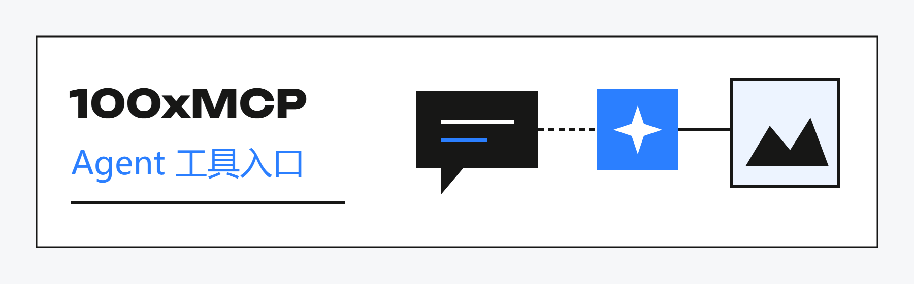

# 100xMCP · Agent 工具入口

**在对话中提出需求，在工作目录里取得素材。**

[← 返回资料库](../../README.md)　·　[↓ 下载完整手册 PDF（6 页）](100xmcp.pdf)

## ✦ 阅读导航

[01 定位与价值](#chapter-1)　·　[02 能力与分工](#chapter-2)　·　[03 工作场景](#chapter-3)　·　[04 开始与协作](#chapter-4)　·　[05 参与建设](#chapter-5)　·　[06 问题与入口](#chapter-6)

## ✦ 01 / 把生成工具带进 Agent 对话

当你已经在 Codex 中整理需求、编写文案或制作页面，视觉素材也应该能接着同一段上下文继续处理。

### 为什么需要它

普通流程往往是复制提示词、切换生成工具、等待任务、下载文件，再把路径带回工作区。100xMCP 让 Agent 发现生成能力、查看报价、在预算内提交任务，并跟进状态与结果。

### 当前交付形态

公开仓提供面向 Codex Desktop 的客户端、官方插件与 100x:100x-creative Skill。客户端公开，生成服务仍为内测接入；服务连接信息由内测管理员提供，公共服务尚未开放。

### 适合谁，交付什么

适合在 Agent 工作过程中需要图片或视频的开发者和创作者。目标交付是工作目录中的素材与可追踪的任务结果。素材能否直接展示，还受宿主媒体能力与权限影响。

## ✦ 02 / 先发现能力，再带预算生成

当前可用型号、报价和任务状态都应从工具取得，不能由 Agent 根据印象填写。

### 01 / 检查连接与型号

先检查连接，读取当前账户可用的型号和模式。目录会变化，某个公示页面列出过的型号不等于当前账户一定可用。连接检查与目录查询可以在不生成素材的情况下完成。

### 02 / 查询报价与确认预算

生成前取得具体报价，确认规格和预算上限。提交使用 max_credits 限制；超出预算时应停止，而不是先执行再告知。价格变化或报价失效时，重新取得报价后再决定。

### 03 / 提交异步任务

生成提交后先返回任务信息，再按服务提示查询进度。立即返回任务号不代表素材已经完成。跟进同一次任务，避免把不确定状态误判为需要再次提交。

### 04 / 取得结果并交付到工作区

完成后取得输出并下载到工作目录。引用本地参考素材时使用真实绝对路径；交付时说明文件在哪里、任务是否成功以及尚需人工检查的地方。具体能力以当前工具与接入指南为准。

## ✦ 03 / 案例：给一段产品介绍配场景图

下面的对话是使用示例，没有真实报价、余额或生成结果。

### 你可以这样开始

> “先检查 100x 连接并列出可用图片型号，不生成。我想为无品牌保温杯做一张办公场景图，请根据目标规格报价，等我确认预算后再提交。”先把查询和实际生成分开，需求更容易核对。

### 01 / 把选择交代清楚

Agent 应说明当前可用能力、需要的输入与具体报价。如果缺少规格或参考素材，先补齐这些信息；不要擅自用另一个模型或更高预算替换用户原意。

### 02 / 确认后提交同一任务

确认预算与输入后提交，记录任务标识，并按查询提示跟进。遇到等待、失败或状态不明时说明真实情况，不能用“已生成”代替尚未完成的过程。

### 03 / 下载并检查文件

生成完成后交付实际文件路径。人工检查图片是否符合主体、画幅和场景要求；如果要继续做视频或页面，应把这份素材明确作为下一步输入。

### 建议验收口径

先报价、后生成；预算限制明确；任务结果可追踪；文件确实可用。生成质量与商业适用性仍由人判断。无需在公开问题中附令牌、余额截图或私有参考素材。

## ✦ 04 / 安装与第一次使用

下面给出公开安装入口和最小使用路径。版本与宿主要求以原仓当前指南为准。

### 在 Codex 中交给 Agent 安装

可在 Codex Desktop 中说：“请阅读 100x-mcp 仓库的 INSTALL.md，按说明安装 100x MCP + Skill 到本机 Codex，检查安装结果。不要在对话里索取或显示访问令牌。”安装文档链接见本册末页。

### 先完成不生成的检查

获得获准的服务接入后，调用 100x:100x-creative 检查连接、型号与账户信息，不提交生成。这样先区分安装、连接与生成服务问题，再进入需要预算的任务。

### 再做一次有明确上限的任务

准备简单需求和目标规格，先查型号、再查报价；确认预算后提交，等待结果并核对工作目录。第一次任务应以走通完整流程为目标，不急于批量扩展。

### MCP 与 SKILL 的区别

MCP 提供调用工具的连接；这里配套的创作 Skill 指导 Agent 使用这些工具。100xSKILL 产品线则提供视频分析、本地化和提示词等内容方法。方法和工具可配合，职责不同。

### 当前接入边界

> 以已发布的 Codex Desktop 接入为主，不声明所有 Agent 宿主都已验证。公开客户端不是免费公共生成服务；连接与使用条件由内测接入方式决定。

## ✦ 05 / 可以从哪些工作参与

一条清楚的安装或任务反馈，往往比一句“工具不能用”更有帮助。

### 任务 A / 安装与连接体验

在获准的宿主环境，按公开文档检查安装、重载与连接。交付操作步骤、宿主版本、失败位置与脱敏反馈。验收时另一位用户能按说明完成同一路径；不记录或转发访问令牌。

### 任务 B / 任务反馈与预算理解

围绕查型号、报价、确认预算、提交和查询几个环节，评估 Agent 是否把事实说明白。交付合成对话用例及期望行为，覆盖等待、超预算、失败与成功；涉及真实生成时按具体预算授权。

### 任务 C / 文件交付与后续使用

检查图片或视频落盘后的路径、格式、预览和下一步引用是否清楚。交付可复现的问题与建议，不把宿主无法内联预览直接归因为生成失败；先确认文件本身是否存在、可读取。

### 开始之前

选择一个宿主与一条明确路径，说明可提供的验证材料和交付。涉及其他宿主适配时单独确认范围；没有实测的兼容性只写待验证，不写成支持承诺。

## ✦ 06 / 常见问题与公开入口

遇到问题时，先区分客户端、服务连接、生成任务和媒体预览四个层次。

### 装好插件就能直接生成吗？

还需要获准的服务接入。当前客户端公开，公共生成服务尚未开放；请按内测接入说明配置，不在公开对话或 Issue 中粘贴令牌。

### 为什么提交后还要等？

图片与视频生成采用异步任务流程。提交返回任务信息后，要继续查询完成状态；任务提交速度不是完整生成耗时。

### 能不能跳过报价直接生成？

工作流要求先读取能力与报价，在明确预算限制下提交。这样用户能够知道此次操作的规格和预算；不能把历史价格当成本次的有效报价。

### 文件生成了，为什么看不到内联预览？

文件下载和宿主内联展示是不同步骤。先核对本地文件，再根据 Codex 当前媒体权限与展示能力处理；预览限制不应被误报成生成失败。

### 继续了解

- [100xMCP 客户端与插件](https://github.com/kezd088/100x-mcp)
- [安装与接入指南](https://github.com/kezd088/100x-mcp/blob/main/INSTALL.md)
- [官网说明](https://100xspeed.app/mcp/)

---

[↓ 保存这份完整手册](100xmcp.pdf)　·　[← 返回生态目录](../../README.md)

资料更新：2026-09-22。插图与示例用于解释产品角色；实际能力与接入以对应产品为准。展示内容使用说明见 [RIGHTS.md](../../RIGHTS.md)。
