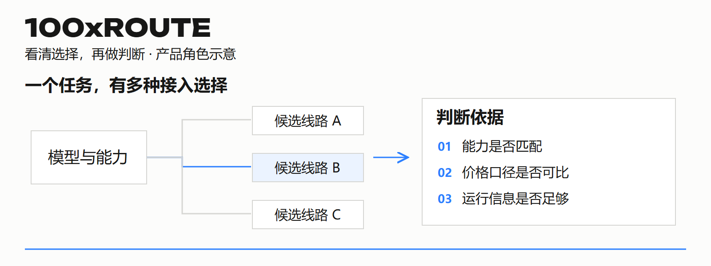

# 100xROUTE · 线路治理与运行观察

**把模型、候选线路与判断依据放在一起。**

[← 返回资料库](../../README.md)　·　[↓ 下载完整手册 PDF（6 页）](100xroute.pdf)

## ✦ 阅读导航

[01 定位与价值](#chapter-1)　·　[02 能力与分工](#chapter-2)　·　[03 工作场景](#chapter-3)　·　[04 开始与协作](#chapter-4)　·　[05 参与建设](#chapter-5)　·　[06 问题与入口](#chapter-6)

## ✦ 01 / 选择一条线路，需要什么依据

能看到一个模型名称，还不足以判断它能否处理你的任务。能力、规格、价格口径和运行证据需要一起看。

### 为什么需要它

模型目录、供应来源、线路配置和运行记录容易散落在配置文件与临时消息里。100xROUTE 将这些信息组织为控制台，帮助团队了解可用选择、查看变化，并形成可回查的运行判断。

### 谁会用到

管理多模型、多线路的产品、研发与运行团队；需要解释“为什么选这一条”“为什么现在不能用”的协作者。它关注目录、配置与判断依据，不是普通创作者的素材编辑界面。

### 当前产品边界

当前为线路控制台，覆盖目录、候选线路、价格与运行观察等工作。对外商业分发和计费属于后续演进方向；不把控制台展示直接等同于所有生产流量都由它调度。

## ✦ 02 / 从目录，到可解释的运行判断

控制台的价值在于把不同来源的信息对应起来，避免只看一个名称、一个价格或一个状态点做决定。

### 01 / 模型与能力目录

了解型号、供应方和任务能力，区分模型本身的能力与某条线路实际声明的支持范围。先确认任务需要什么，再找覆盖该任务的候选项；目录中的存在不自动证明具体输入已经实测通过。

### 02 / 候选线路与配置

查看与整理线路配置、选择目标及覆盖关系。低价、稳定、极速或官方等目标用于表达取舍，它们不是未经测量就成立的性能结论。变更配置后，原有运行判断是否仍有效需要重新检查。

### 03 / 价格信息与比较口径

比较价格之前，先对齐任务模式、输入输出规格与计费单位。历史记录与当前依据分开看；缺少规格或来源时，保留未知信息比给出一个看似精确的排序更有用。

### 04 / 探测、请求与告警线索

结合探测结果、请求记录和告警查看运行状况，区分待测、历史结果和当前证据。状态应有来源和时间，异常需要能追到具体对象，而不是只给出一个无法解释的红点或绿点。

## ✦ 03 / 案例：比较同一任务的候选线路

以下是团队评估流程示例，不使用真实供应方成本、生产端点或未核实的性能数字。

### 评估问题

> 团队需要为一种图片任务选择接入来源，存在候选线路 A、B、C。目标是判断哪些线路支持所需能力，以及现有信息是否足以作出选择，而不是直接选表面最低价格。

### 01 / 先排除不匹配的能力

确认任务输入、输出规格和必要模式，核对候选线路是否声明支持。将不支持、未验证和缺少信息的项目分别记录，避免把它们都当作“可用”。

### 02 / 再对齐可比较的口径

把价格单位、规格与信息来源放在同一比较条件下。不同规格的数字不能直接排名；数据不足时记录缺口，而不是用推测值补齐表格。

### 03 / 查看证据，再形成建议

查看运行信息的来源、时效与关联配置。建议写清选择理由、尚未确认的条件和需要补充的验证；如果配置发生变化，重新判断旧证据是否还适用。

### 建议交付物

一份候选目录、同口径比较说明、待补信息清单与接入建议。每个判断都能回到具体依据；没有本次实测，就不写健康率、延迟或成本收益结论。

## ✦ 04 / 控制台怎样进入团队工作

先把对象、来源和状态说清楚，再讨论扩大自动化。

### 第一次整理：统一对象身份

先选一个明确的任务类型，整理它涉及的模型、供应来源和候选线路。相同名称可能对应不同能力或规格，记录时需要保留足够区分的信息，避免后续反馈找错对象。

### 第一次判断：明确未知项

将已知配置、已取得的运行依据和待验证条件分开。控制台帮助把信息集中起来；判断是否充分，仍要回到任务目标与实际证据。

### 与 API 的关系

ROUTE 关注有哪些选择、如何管理与判断；API 关注调用方如何提交生成任务并取得结果。线路管理与生成执行是两类职责，具体控制范围以实际接入为准。

### 与 SPEED、MCP 的关系

上层工作台和 Agent 工具需要可靠的服务选择，但普通使用者不一定直接操作线路控制台。介绍这些关系是为了理解分工，不表示所有产品已形成统一生产链路。

### 当前开放状态

> 控制台按受控方式参与协作。公开材料不展示供应方凭据、生产端点、实际成本或内部资源策略；接入、测试与运行权限需按具体任务确认。

## ✦ 05 / 可以从哪些工作参与

把改进绑定到一个可核对的问题，比泛泛提出“优化路由”更容易形成结果。

### 任务 A / 目录准确性

选一组获准核对的模型与线路，检查名称、能力、规格与来源是否一致。交付差异清单和修订依据；不因名称相似就合并，也不把未验证能力写成已支持。验收时每处变化可回查来源。

### 任务 B / 价格比较口径

围绕一个具体生成场景整理比较方法，明确规格、计费单位、时间与缺失项。交付合成示例和说明，让另一位协作者能复现判断。真实成本与供应约定留在受控资料内。

### 任务 C / 状态可解释性

从一个异常场景出发，检查用户能否知道是哪条线路、什么证据、什么时候出现问题。交付问题复现、字段含义和反馈改进建议；同时覆盖待测与未知状态，不只展示成功状态。

### 怎样提出合作任务

说明对象、现有疑问、可取得的依据和你能交付的结果。确认任务边界与环境后开始；体验报告可公开通用问题，具体资源信息按项目权限处理。

## ✦ 06 / 常见问题与判断边界

线路管理最需要保留的，是判断为什么成立，以及什么时候需要重新判断。

### 标成“极速”就代表延迟最低吗？

它可以是一种选择目标或策略类别。是否更快，必须在可比较的任务条件下查看实际证据，不能从标签本身推出性能结论。

### 看到正常状态就能用于任何任务吗？

不能这样推断。任务模式、输入规格、配置和证据时效都影响适用范围；一次探测或历史成功也不等同于所有生成场景已验证。

### 它是不是对外售卖线路的平台？

当前介绍的是线路治理控制台。对外商业分发、计费和自助接入是后续演进方向，不作为本册现有功能宣传。

### 公开仓为什么没有生产控制台截图？

当前截图和图解只保留适合公开的信息。真实线路页面可能包含供应关系、端点、成本与运行记录，因此不能直接整页公开。

### 下一步怎么了解？

带着一个具体任务或线路判断问题，说明你需要核对的能力与证据。受控接入和协作范围经现有联系人确认；也可先阅读 API 手册理解生成服务职责。

### 继续了解

- [本产品完整说明](https://github.com/kezd088/100x-roadmap-showcase/tree/main/products/100xroute)
- [了解 100xAPI](https://github.com/kezd088/100x-roadmap-showcase/tree/main/products/100xapi)

---

[↓ 保存这份完整手册](100xroute.pdf)　·　[← 返回生态目录](../../README.md)

资料更新：2026-09-22。插图与示例用于解释产品角色；实际能力与接入以对应产品为准。展示内容使用说明见 [RIGHTS.md](../../RIGHTS.md)。
