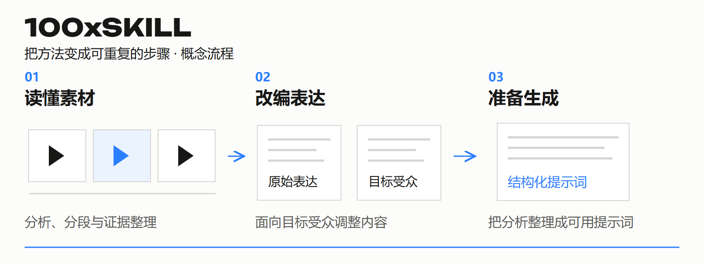

# 100xSKILL

**把内容制作的方法，整理成 Agent 可以重复执行的步骤。**

[← 返回资料库](../../README.md) · [下载独立 PDF（2 页）](100xskill.pdf)

## 适合谁，解决什么

制作 TikTok / UGC 内容、做跨语言改编和视觉变体的创作者与团队。

一个好结果难以复现；分析、改写、拆镜和提示词分散，没有一致的输入输出与检查方法。

## 可以怎样用

### 读懂素材

视频分析、分段与搜索词整理，把判断尽量绑定到可回查的素材证据。

### 改编表达

通过本地化、人物表达和夸张表达等专项流程，按目标受众调整内容。

### 生成准备

通过视觉裂变与提示词组装，让上一步输出能进入下一步工作。

## 一个具体场景

把一段商品口播改编为另一市场的版本。先分析结构，再处理语言、人物表达和镜头提示，最后回看原素材与目标要求，交给人或生成工具继续处理。

*这是帮助理解产品用途的概念案例。*

给出素材与目标 → 选择合适的 Skill → 生成结构化输出 → 回看证据，检查与交接。

## 你会得到什么

结构化分析、改编稿、镜头说明和提示词等中间产物。

## 在生态中的位置

SKILL 负责方法，MCP 负责工具连接。两者可以配合使用：先组织分析与提示词，再交给工具执行。

## 当前状态与入口

以公开的 100x-skill-tiktok 技能框架为代表，包含 8 个功能 Skill 和 1 个路由入口。内部语料和校准资产保持私有。

[打开产品入口](https://github.com/kezd088/100x-skill-tiktok)

## 可以从这些事参与

通用流程、合成样例、输出契约、可复现的评估反馈。

通过现有联系人说明经历和想做的具体任务，确认范围与交付后开始。

资料更新：2026-09-22。展示内容的使用说明见 [RIGHTS.md](../../RIGHTS.md)。
