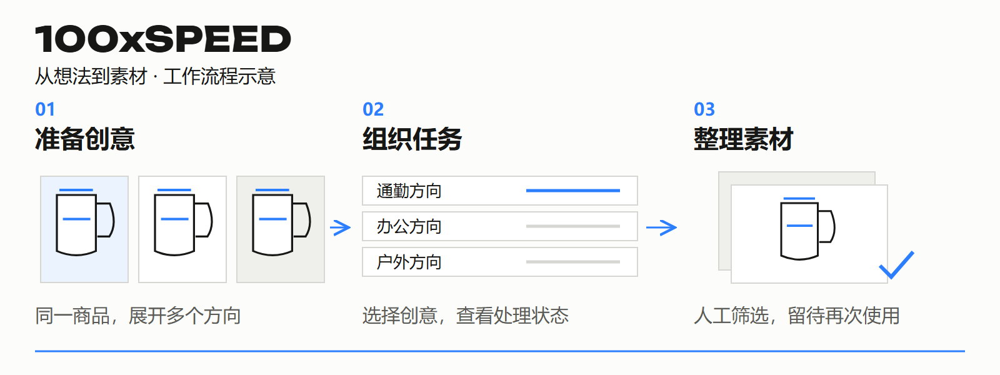

# 100xSPEED

**把提示词、批量生成和资产管理放进同一个创作工作台。**

[← 返回资料库](../../README.md) · [下载独立 PDF（2 页）](100xspeed.pdf)

## 适合谁，解决什么

需要制作和迭代图片、视频素材的创作者与内容团队。

创意分散在聊天、生成工具和文件夹里，任务状态难跟踪，结果难以继续复用。

## 可以怎样用

### 创意区

整理提示词与参考方向，用变量思路展开不同创意，让素材想法形成可选择的任务。

### 任务区

将选中的创意组织为生成任务，观察处理状态与结果，减少在多个窗口来回找任务。

### 资产库

检索、筛选和整理生成结果，为下一轮创作保留素材。

## 一个具体场景

为同一款保温杯准备通勤、办公与户外三个视觉方向。在创意区准备素材想法，选择任务进行生成，再到资产库比较结果，挑选值得继续迭代的方向。

*这是帮助理解产品用途的概念案例。*

明确受众与素材用途 → 准备多个创意方向 → 选择任务并生成 → 检查结果，整理素材。

## 你会得到什么

经过人工筛选的图片、视频素材，以及可继续迭代的创意记录。

## 在生态中的位置

SPEED 是面向人的创作工作台；MCP 是面向 Agent 的工具入口；API 与 ROUTE 关注后端服务和线路治理；SKILL 提供内容分析与提示词方法。

## 当前状态与入口

Web 创作工作台，包含创意区、任务区和资产库。可用模型与服务以实际接入为准。生成素材仍需人工检查。

[打开产品入口](https://100xspeed.app/)

## 可以从这些事参与

创作体验、任务可靠性、资产检索、真实工作流反馈。

通过现有联系人说明经历和想做的具体任务，确认范围与交付后开始。

资料更新：2026-09-22。展示内容的使用说明见 [RIGHTS.md](../../RIGHTS.md)。
